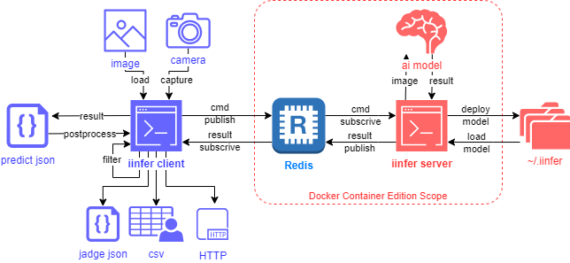

.. -*- coding: utf-8 -*-

****************
iinferの概要
****************

- iinferを使用することで、AIモデルを簡単に実行することが出来ます。
- onnx又はmmlabフォーマットのAIモデルファイルを実行するアプリケーションです。

iinderの動作イメージ
====================

1. **iinfer client** は **imageファイル** や **camera** から画像を取得し、 **推論結果 predict.json** を出力します。
2. **iinfer server** は推論を行うサーバーです。 **iinfer client** からの要求に応えて、推論結果を **iinfer client** に返します。
3. **iinfer server** は予め **ai model** をロードしておくことで、推論を高速化します。
4. **iinfer client** と **iinfer server** は **Redis** 経由で通信します。
5. **iinfer server** と **Redis** は **dockerコンテナ** を使用して起動させることが出来ます。

インストール方法
================

次の手順でインストールしてください:

1. pipを使用してインストールします:

  .. code-block:: bash

      pip install iinfer

2. コマンドラインオプションを補完するときは次のコマンドを実行します。（Ubuntuの場合のみ）:

  .. code-block:: bash

      eval "$(register-python-argcomplete iinfer)"

3. サーバーコンテナをインストールする場合は次のコマンドを実行します。（Ubuntuの場合のみ）:

  .. code-block:: bash

      iinfer -m install -c server
      docker-compose -f up -d

iinferの使用方法
================

iinferを使用するには、次のコマンドを実行します:

1. サーバーの起動（Windowsの場合）:

  .. code-block:: bat

    REM Redisサーバーコンテナの起動
    iinfer -m redis -c docker_run -f \
                                  --wsl_name <WSLのディストリビューションの名前> \
                                  --wsl_user <WSLのLinux内のDockerが使えるユーザー>

    REM 推論処理を実行するサーバープロセスの起動
    iinfer -m server -c start -f

2. サーバーの起動（Ubuntuの場合）:

  .. code-block:: bash

    # Redisサーバーコンテナと推論処理を実行するサーバープロセスの起動
    docker-compose up -d

3. AIモデルのデプロイ:

  .. code-block:: bash

    # 画像AIモデルのデプロイ
    # 推論タイプはモデルのAIタスクやアルゴリズムに合わせて指定する。指定可能なキーワードは"iinfer -m client -c predict_type_list"コマンド参照。
    iinfer -m client -c deploy -n <任意のモデル名> -f \
                                --model_img_width <モデルのINPUTサイズ(横幅)> \
                                --model_img_height <モデルのINPUTサイズ(縦幅)> \
                                --model_file <モデルファイル> \
                                --model_conf_file <モデル設定ファイル> \
                                --predict_type <推論タイプ> \
                                --label_file <ラベルファイル>

    # デプロイされている画像AIモデルの一覧
    iinfer -m client -c deploy_list -f

4. AIモデルのセッションを開始:

  .. code-block:: bash

    # 画像AIモデルを起動させて推論可能な状態に(セッションを確保)する
    # use_trackを指定するとObjectDetectionタスクの結果に対して、MOT（Multi Object Tracking）を実行しトラッキングIDを出力する。
    iinfer -m client -c start -n <モデル名> -f \
                              --use_track

5. 推論を実行:

  .. code-block:: bash

    # 推論を実行する
    # output_previewを指定するとimshowで推論結果画像を表示する（GUI必要）
    iinfer -m client -c predict -n <モデル名> -f \
                                -i <推論させる画像ファイル> \
                                -o <推論結果の画像ファイル> \
                                --output_preview

    # カメラキャプチャー画像を元に推論を実行し、クラススコアが0.8以上の物体のみを検出する
    # --stdin --image_type capture で標準入力のキャプチャー画像を推論する
    iinfer -m client -c capture | \
    iinfer -m client -c predict -n <モデル名> \
                                --stdin \
                                --image_type capture \
                                --nodraw | \
    iinfer -m postprocess -c det_filter -f -P \
                                --stdin \
                                --score_th 0.8

6. AIモデルのセッションを開放:

  .. code-block:: bash

    # 画像AIモデルを停止させてセッションを開放
    iinfer -m client -c stop -n <モデル名> -f

7. サーバーの停止（Ubuntuの場合）:

  .. code-block:: bash

    # Redisサーバーコンテナと推論処理を実行するサーバープロセスの停止
    docker-compose down

8. サーバーの停止（Windowsの場合）:

  .. code-block:: bat

    REM 推論処理を実行するサーバープロセスの停止
    iinfer -m server -c stop -f

    REM Redisサーバーコンテナの停止
    iinfer -m redis -c docker_stop -f \
                                    --wsl_name <WSLのディストリビューションの名前> \
                                    --wsl_user <WSLのLinux内のDockerが使えるユーザー>

データの保存場所
================

  .. code-block:: python

    pathlib.Path(HOME_DIR) / '.iinfer'

