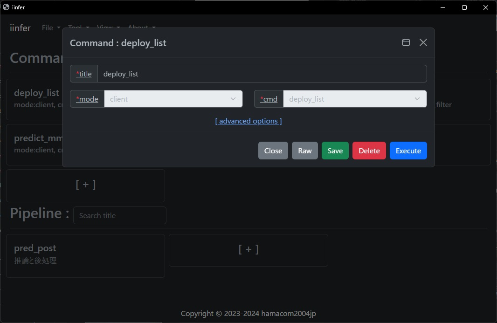

.. -*- coding: utf-8 -*-

****************
Webモード
****************

- iinferのWebモードを使用することで、GUIモードで作成したコマンドやパイプラインをWebAPI経由で実行することが出来ます。
- Webモードは `iinfer -m web -c start` コマンドで起動出来ます。
- Webモードを起動させると、下記のHTTPリクエストを受け付けられるようになります。

コマンド実行 : `http://<ホスト>:<ポート>/exec_cmd/<title>`
==============================================================================

- **<ホスト>** には、Webモードを起動したホスト名またはIPアドレスを指定します。
- **<ポート>** には、Webモードを起動したポート番号を指定します。 `--listen_port` オプションで指定したポート番号です。
- **<title>** には、登録したコマンドのタイトルを指定します。
- タイトル **deploy_list** を実行する例を示します。

    .. code-block:: bash

        curl http://localhost:8081/exec_cmd/deploy_list

- GUIモードで登録したコマンドのRawボタンを押すと、curlコマンドの例を確認できます。

- predictなど推論させたい画像をアップロードする場合は、 `-F "＜オプション名＞=@＜ファイル名＞"` を指定します。
- タイトル **predict_mmdet** を実行する例を示します。

    .. code-block:: bash

        curl -F "input_file=@<input_file>" http://localhost:8081/exec_cmd/predict_mmdet

- Rawボタンを表示すると、下記のようにcurlコマンドが表示されます。

.. image:: ../static/ss/00244_cmd_predict.jpg

パイプライン実行 : `http://<ホスト>:<ポート>/exec_pipe/<title>`
==============================================================================

- **<ホスト>** には、Webモードを起動したホスト名またはIPアドレスを指定します。
- **<ポート>** には、Webモードを起動したポート番号を指定します。 `--listen_port` オプションで指定したポート番号です。
- **<title>** には、登録したパイプラインのタイトルを指定します。
- タイトル **pred_post** を実行する例を示します。
- predictなど推論させたい画像をアップロードする場合は、 `-F "＜オプション名＞=@＜ファイル名＞"` を指定します。

    .. code-block:: bash

        curl -F "input_file=@<input_file>" http://localhost:8081/exec_pipe/pred_post

- GUIモードで登録したパイプラインのRawボタンを押すと、curlコマンドの例を確認できます。

.. image:: ../static/ss/00312_pipe.jpg

ファイラー表示 : `http://<ホスト>:<ポート>/filer`
==============================================================================

- ブラウザでこのURLにアクセスすると、ファイル転送用のファイラーが表示されます。
- ファイラーを使用することで、ローカル(ブラウザ側)とサーバー(iinfer client 又は iinfer server)間で、ファイルをアップロード/ダウンロードすることが出来ます。
- **<ホスト>** には、Webモードを起動したホスト名またはIPアドレスを指定します。
- **<ポート>** には、Webモードを起動したポート番号を指定します。 `--listen_port` オプションで指定したポート番号です。
- ファイラー画面をカスタマイズする場合は、 `--filer_html <filer.htmlファイルのパス>` 、 `--assets <jsやcssファイルのパス>` などのオプションを指定してください。

.. image:: ../static/ss/00401_web.jpg

推論結果表示 : `http://<ホスト>:<ポート>/showimg`
==============================================================================

- ブラウザでこのURLにアクセスすると、推論結果を表示する画面が表示されます。
- 推論結果画面に推論結果を表示するには、 **client** モードの **deploy** コマンドの `--after_injection_type <後処理タイプ>` で `after_showimg_injection` を指定する必要があります。
- 推論結果画面をカスタマイズする場合は、 `--showimg_html <showimg.htmlファイルのパス>` 、 `--assets <jsやcssファイルのパス>` などのオプションを指定してください。
